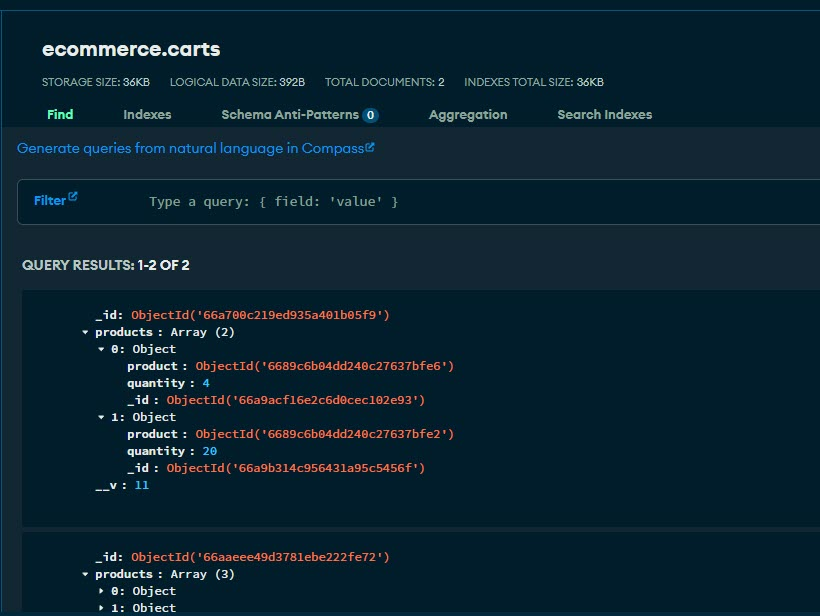
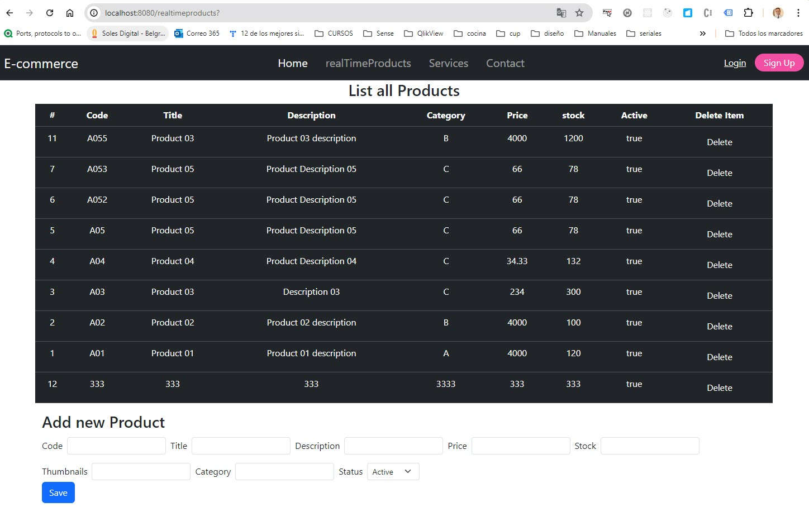
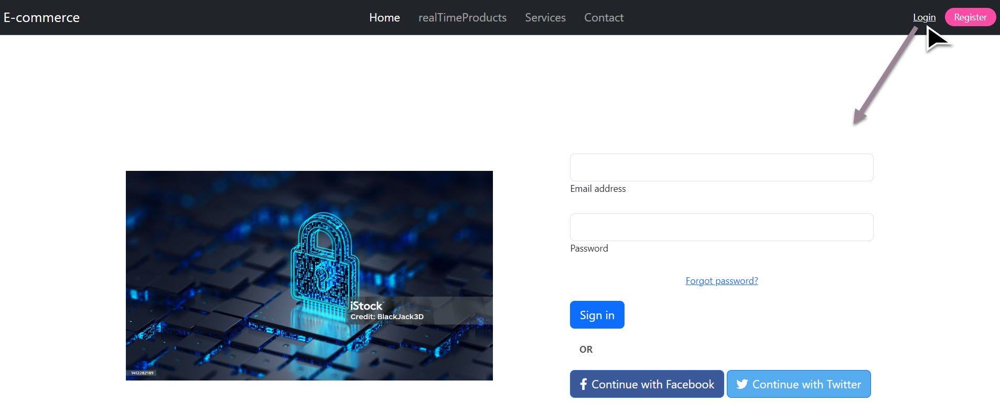
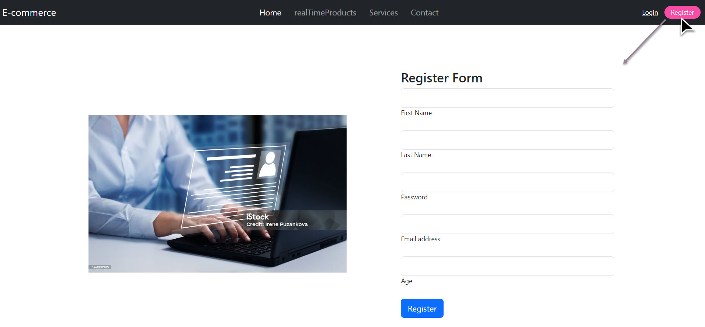

# CODERHOUSE - Programación Backend

We are going to detail in this documentation the different routes and parameters that can be used with this API REST


# API Reference


### PRODUCTS API REFERENCE

### Get all products
Return all products
```http
  GET /api/products
```
 Markdown


### Get a particular product 
Returns the values ​​of the product whose id matches with the id passed as a parameter
```http
  GET /api/products/${id}
```
| Parameter | Type     | Description                          |
| :-------- | :------- | :----------------------------------- |
| `id`      | `number` | **Required**. Id of product to fetch |

## Post add a new product 
 Add a new product, automatically assigning a value to the id field. A product type object must be passed through the query.body according to what is specified below
```http
  POST /api/products
```
| Parameter | Type     | Description                                 |
| :-------- | :------- | :------------------------------------------ |
|           | `object` | **Required**. an product Object in req.Body |

The product objects contain the next format
        `
        {

            "title": "Product_title",                   string
            "description": "Product_description",       string
            "price": product_price,                     number
            "thumbnails": [
                "img.1",                                string
                "img.2",                                string
                "img.3"                                 string
                ....                                    string
            ],
            "code": "product_code",                     string
            "stock": product_stock,                     mumber
            "status": product_status,                   boolean
            "category": "product_category"              string
            
        }
        `
### Update a particular product 
A product must be taken and updated by the object sent from body. The id should never be updated or deleted when making said update.

The Product Object can contain only the fields that will be modified or all of product fields. The logic in this route clones the original values ​​and cleverly only updates the submitted fields.

Below I leave you an example of a partial update

```http
  PUT /api/products/${id}
```
| Parameter | Type     | Description                            |
| :-------- | :------- | :------------------------------------- |
| `id`      | `number` | **Required**. Id of product to fetch   |
|           | `object` | **required**. Body product object

Example partial object product to use in req.body


### Delete a particular product 
Delete a product indicating its product ID
```http
  DEL /api/products/${id}
```
| Parameter | Type     | Description                          |
| :-------- | :------- | :----------------------------------- |
| `id`      | `number` | **Required**. Id of product to delete |

.


### CARTS API REFERENCE

## Post add a new cart 
This route creates a new cart with the following structure:

- Id:Number, this is autogenerated without being able to repeat itself.
- products: Array that will contain objects that represent each product. Initially it will be an empty array when creating the cart
```http
  POST /api/carts
```


Example of initial cart created

`{  "id": 4,
    "products": []
}
`
## Post add a new product to especif cart 

```http
  POST /api/carts/:cid/product/:pid 
```
This route adds the product to the “products” array of the chosen cart, adding it as an object in the following format:

- product: SHOULD ONLY CONTAIN THE PRODUCT ID (It is crucial that you do not add the entire product)
- quantity: must contain the number of copies of said product. The product quantity parameter have a 1 value for default, if this is omit in the call

Additionally, if an existing product tries to be added to the product, increment the quantity field of said product.

| Parameter | Type     | Description                                 |Body |
| :-------- | :------- | :------------------------------------------ |:------|
|  `cid`    | `integer`  | id of cart to update the product            ||
|  `pid`    | `integer`  | id of product to add in cart          ||
| `quantity` |`object`|  |{  "quantity": 33 } |

Example of cart updated 



### Get a particular Cart
Returns the list of products that belong to the cart with the id parameter provided.
```http
  GET /api/carts/${id}
```
| Parameter | Type     | Description                          |
| :-------- | :------- | :----------------------------------- |
| `id`      | `number` | **Required**. Id of cart to fetch |

---
### Delete Product from specified Cart
This metod permit drop a specified product from one cart.

```http
  DELETE /api/carts/:cid/products/:pid
```
| Parameter | Type     | Description                          |
| :-------- | :------- | :----------------------------------- |
| cid     | `number` | **Required**. Id of cart to fetch |
| pid     | `number` | **Required**. Id of product to delete |


### update all Products from specified Cart
This metod permit update the products array completed. replace the content of products array in the cart record

```http
  PUT /api/carts/:cid
```
| Parameter | Type     | Description                          |
| :-------- | :------- | :----------------------------------- |
| cid     | `number` | **Required**. Id of cart to UPDATE |

In the body pass the products arrays , example
```http
[
  { 
    "product": "6689c6b04dd240c27637bfe0",
    "quantity": 1
  },
  { 
    "product": "6689c6b04dd240c27637bfe1",
    "quantity": 2
  },
  { 
    "product": "6689c6b04dd240c27637bfe5",
    "quantity": 3
  }
]
```


# Using Handelbars templates and Socket.IO

Handlebars compiles templates into JavaScript functions. This makes the template execution faster than most other template engines.
Install Handlebars using npm:

`  $ npm install express-handlebars  `

And Socket.IO is a library that enables low-latency, bidirectional and event-based communication between a client and a server.

For install socket-io in the server execute te following command

` npm install socket.io `

### Get all products (http request using handlebars templates)
Returns the list of all e-commerce products 
```http
  GET /
```
| Parameter | Type     | Description                          |
| :-------- | :------- | :----------------------------------- |
| none   | none|none |


### Get all products and add products using socket.io and handlebars templates

Shows all products available in the ecommerce site, and allows registration of new products
```socket-io
  /realtimeproducts
```




### Login Page
Permit the user login in the site
```http
  route :  /api/sessions/login
  method:  POST 
```
| Parameter | Type     | Description                          |
| :-------- | :------- | :----------------------------------- |
| email   | text|user emeail |
| password | password | user password |



### Register Page
Permit register a new user to access in the site
```http
  route :  /api/sessions/register
  method:  POST 
```
| Parameter  | Type     | Description                          |
| :--------  | :------- | :----------------------------------- |
| first_name | text | user first name |
| last_name  | text | user last name |
| email   | text|user emeail |
| password | password | user password |
| age | number | user age |

the site assign by default and user role USER, another role posible is ADMIN




## END